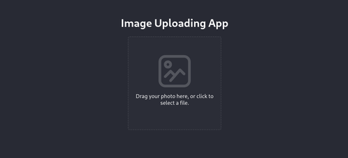
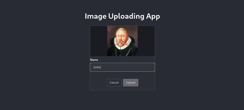
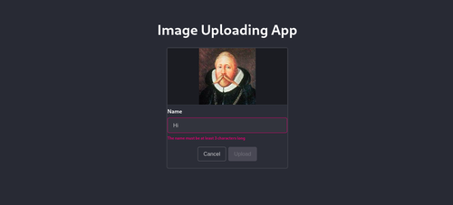
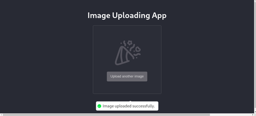
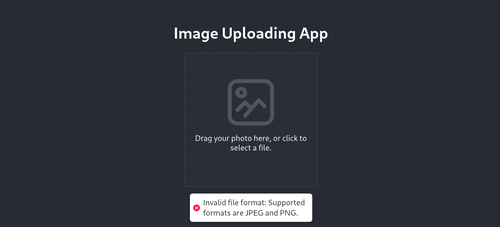

# Knodd Programming Assignment

> Submitted by: Johannes Hildén <hildenjohannes@gmail.com>

## 👩‍💻 Evaluating the app

Verify that the backend service is running at [http://localhost:3002](http://localhost:3002/).
Then, from this directory (`image-app/frontend/`):

1. Install the package dependencies:

```
npm install
```

2. Run the frontend app in developmnent mode:

```
npm run dev
```

3. Visit [http://localhost:3000](http://localhost:3000/) in the browser.

### E2E Tests

Run the tests using `npm run test`, or type `npx cypress open` to launch the Cypress test runner.

## 🛠️ Building

Run `npm run build` to build the app for production.

## Screenshots






